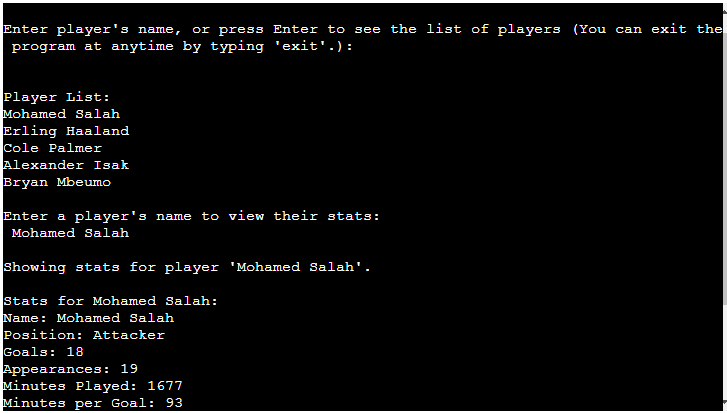
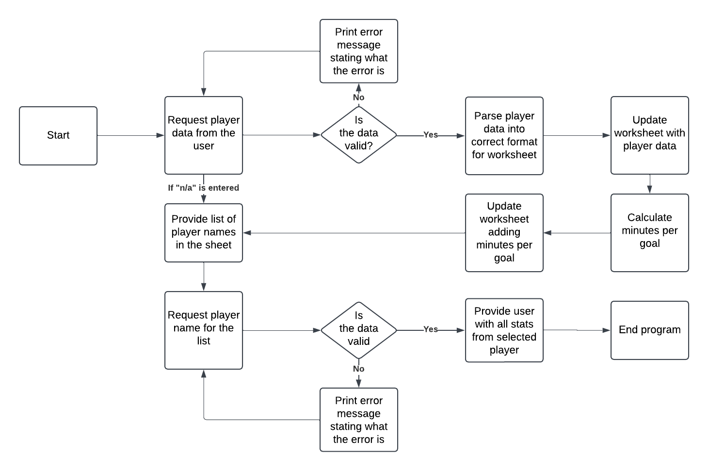
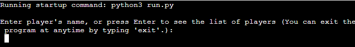
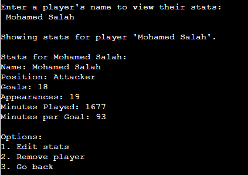
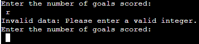
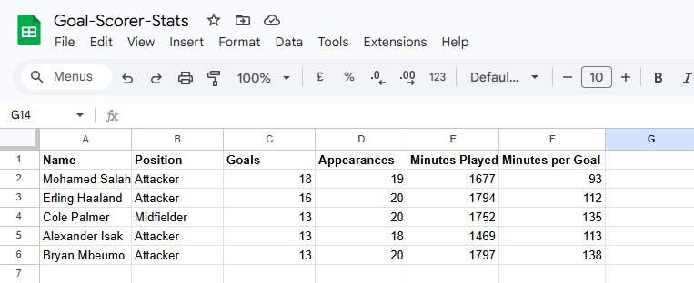
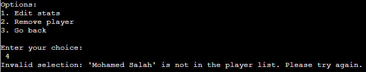

# Goal Scorer Stats Manager

Goal Scorer Stats Manager is a usful tool, whether you are a Premier League club or just a fan of the beautiful game. 
Stats have become essential for team selection, scouting for players, or just deciding who to captain in your fantasy team. 

The deployed project live link is [HERE](https://goal-scorer-stats-d418002caeb6.herokuapp.com/)

## Contents

- [Introduction](#introduction)
- [Project](#project)
  - [User goals:](#user-goals)
  - [Site owner goals](#site-owner-goals)
- [Pre development](#pre-development)
- [Development](#development)
- [Features](#features)

- [Google Sheets](#google-sheets)
  - [Stats](#Stats)
- [Technologies Used](#technologies-used)
- [Resources](#resources)
  - [Libraries](#libraries)
- [Testing](#testing)
- [Future Updates](#future-updates)  
- [Validation](#validation)
- [Deployment](#deployment)
  - [Heroku](#heroku)
  - [Branching the GitHub Repository using GitHub Desktop and Visual Studio Code](#branching-the-github-repository-using-github-desktop-and-visual-studio-code)
- [Bugs](#bugs)
- [Credits](#credits)
- [Acknowledgements](#acknowledgements)

## Introduction

The Goal Scorer Stats Manager is a Python-baesd application designed to manage and analyze football player statistics. The program integrates with Google Sheets to provide a seamless way to store, view, edit, and delete player records. Users can track key performance metrics, including goals scored, matches played, minutes played, and calculate a player's "minutes per goal" efficiency.

## Project

This project is designed to simplify performance tracking for coaching, analysts, and football enthusiasts, ensuring data accuracy and accessibility.

### User goals

Get clear instructions on how to use the system in front of them that they can refer to if needed.
Be able to enter detailed performance data for football players.
Retrieve and display stats for any player stored in the Google Sheets quickly.
Update existing player performance metrics to keep records accurate and up-to-date.
Delete outdated or incorrect player data from the system seamlessly.
Use metrics like minutes per goal to evaluate efficiency and make infromed decisions based on performance trends.
Access and interact with the system using a clear, menu-driven interface, with prompts for each action and the ability to exit at any time.

### Site owner goals

Provide a program that is easy to use and maintain.
Present a program that gives clear instructions each time a user visits.
Enhance efficiency by simplifying the process of data input, retrieval, and management.
Maintain accurate records by updating and removing player data, so the information remains current and relevant. 
Provide features like "minutes per goal" calculations to help users analyze player efficiency effectively.

### Pre development

I created a flow chart to help me take each piece of code one step at a time.

### Development

Code was written for each part of the program starting with the opening promt of the players name or typing "Enter" for the players list. Once all sections had been created testing took place which highlighted the need for additional features.

i.e. After selecting a players name from the list and being shown their stats, an option menu was created to enbale the user to edit or remove the selected player.

## Features

### Dynamic Data Management:
Add new players or update existing ones directly in the Google Sheets database.

### Interactive Interface:
View player stats, make edits, or remove entries using intuitive prompts.

### Error Handling
Built-in validtion ensure only valid data is entered, avoiding errors like divsion by zero.

### Cloud integration:
Leverages Google Sheets for data storage, making stats accessible from anywhere.

## Google Sheets

### Stats

In this area the following player stats are included:

- Player's name
- Player's position
- Goals scored
- Matches played
- Minutes played
- Minutes per goal

## Technologies Used

The main technology used to create this program is Python
Google API
Google Sheets

### Resources

- GitHub 
- Heroku

### Libraries

[Gspread](https://docs.gspread.org/en/latest/) 
[Google-auth](https://google-auth.readthedocs.io/en/master/) 
[Math](https://docs.python.org/3/library/math.html) 
[Sys](https://docs.python.org/3/library/sys.html)

## Testing

The portal has been well tested and the results can be viewed [here - TESTING](https://github.com/IeuanPriede/goal-scorer-stats/blob/main/TESTING.md)

## Future Updates

The next update of the app will include the option to choose whether it is their first visit (which will show the instructions) or whether they have used the service before.
Additional stats to be added such as assists, shots on target etc.

## Validation

PEP8 - Python style checker - https://pep8ci.herokuapp.com/ All code validated and where lines were showing as too long they were adjusted.

## deployment

### Heroku

The Application has been deployed from GitHub to Heroku by following the steps:

Create or log in to your account at heroku.com
Create a new app, add a unique app name ( for example goal-scorer-stats) and then choose your region
Click on create app
Go to "Settings"
Under Config Vars add the private API key information using key 'CRED' and into the value area copy the API key information added to the .json file. Also add a key 'PORT' and value '8000'.
Add required buildpacks (further dependencies). For this project, set it up so Python will be on top and Node.js on bottom
Go to "Deploy" and select "GitHub" in "Deployment method"
To connect Heroku app to your Github repository code enter your repository name, click 'Search' and then 'Connect' when it shows below.
Choose the branch you want to build your app from
If preferred, click on "Enable Automatic Deploys", which keeps the app up to date with your GitHub repository
Wait for the app to build. Once ready you will see the “App was successfully deployed” message and a 'View' button to take you to your deployed link.

### Branching the GitHub Repository using GitHub Desktop and Visual Studio Code
1. Go to the GitHub repository.
2. Click on the branch button in the left hand side under the repository name.
3. Give your branch a name.
4. Go to the CODE area on the right and select "Open with GitHub Desktop".
5. You will be asked if you want to clone the repository - say yes.
6. GitHub desktop will suggest what to do next - select Open code using Visual Studio Code.

The deployed project live link is [HERE]

## Bugs

Incorrect error message when an option has been selected outside the available options.

## Credits

Code Institute: Provided educational materials and support to guide the development of this project.

Stack Overflow: For troubleshooting and debugging various issues during development.

PEP 8 – Style Guide for Python Code: Referenced for adhering to Python coding standards.

## Acknowledgements 

My mentor Jubril Akolade for suggesting additional features to improve the program.

A big thank you to the open-source community for the libraries and resources used in this project.